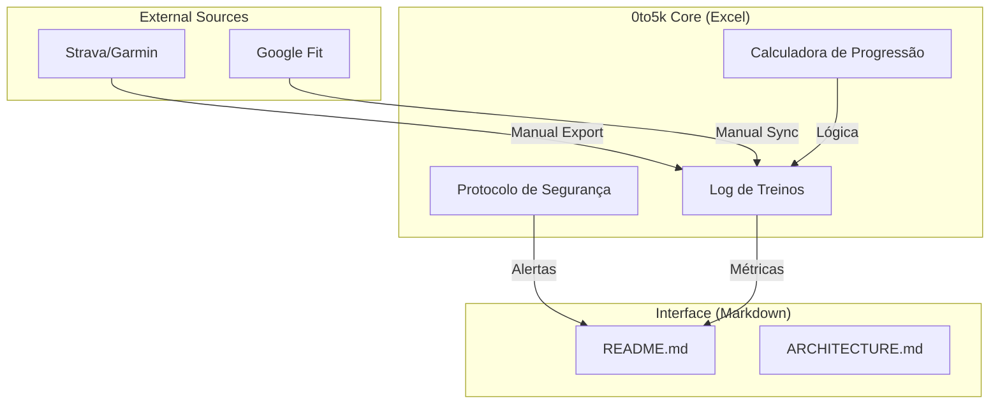
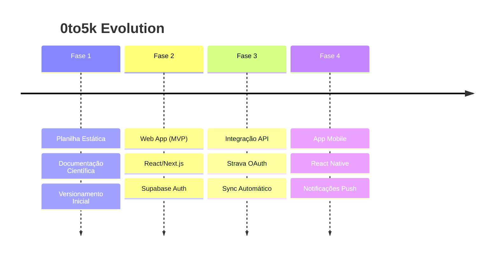

# Architecture Overview - 0to5k

Este documento fornece uma visão técnica e estrutural do projeto **0to5k**. Ele serve como guia para desenvolvedores e arquitetos que desejam entender a organização atual e o roadmap tecnológico.

## 1. Project Structure

A estrutura é focada na entrega de ativos de dados e documentação técnica.

```text
[Project Root]/
├── data/planilha_zero_aos_5km.xlsx   # Core: Motor de dados e lógica de progressão
├── assets/images/banner.png                   # Branding: Ativo visual principal
├── .gitignore                   # Versionamento: Regras de exclusão
├── README.md                    # Interface: Guia do usuário e documentação científica
└── ARCHITECTURE.md              # Estrutura: Visão técnica e roadmap (Este arquivo)
```

## 2. High-Level System Diagram

Atualmente, o fluxo é linear e baseado em entrada manual, com visão para automação futura.



## 3. Core Components

### 3.1. Data Engine (Spreadsheet)

A planilha Excel não é apenas uma tabela, mas o "motor" do projeto, dividida em módulos:

- **Plano de Treinos**: Módulo de entrada/saída de dados semanais.
- **Dicas & Protocolo**: Módulo de regras de negócio e validação clínica.
- **Resumo Semanal**: Camada de agregação e visualização de métricas.

**Tecnologias**: Microsoft Excel, OpenXML, Fórmulas estáticas.

### 3.2. Documentation & UI (Markdown)

O `README.md` atua como a interface rica para o usuário, consumindo as definições estabelecidas na camada de dados.

## 4. Data Stores

### 4.1. Primary Store

**Nome**: `data/planilha_zero_aos_5km.xlsx`
**Propósito**: Armazenamento persistente (local) de treinos e progresso.
**Métricas principais**: Distância (km), Tempo (min), PSE (Esforço), FC (bpm).

## 5. Security & Privacy

Como o sistema é **local-first**:

- **Privacidade**: 100% dos dados de saúde ficam no dispositivo do usuário.
- **Segurança**: Versionamento via Git apenas para a estrutura, nunca para os dados sensíveis do usuário (configurado via `.gitignore`).

## 6. Roadmap Tecnológico

O objetivo é transformar este repositório de dados em uma plataforma SaaS.



## 7. Project Identification

**Project Name**: 0to5k
**Repository**: [github.com/prof-ramos/0to5k](https://github.com/prof-ramos/0to5k)
**Lead**: Gabriel Ramos
**Last Update**: 2026-02-21

## 8. Glossary

- **PSE**: Percepção Subjetiva de Esforço (Escala Borg adaptada 1-10).
- **C25K**: Couch to 5K.
- **ASPC**: American Society of Preventive Cardiology.
- **Local-First**: Arquitetura onde o dado reside primariamente no cliente.
