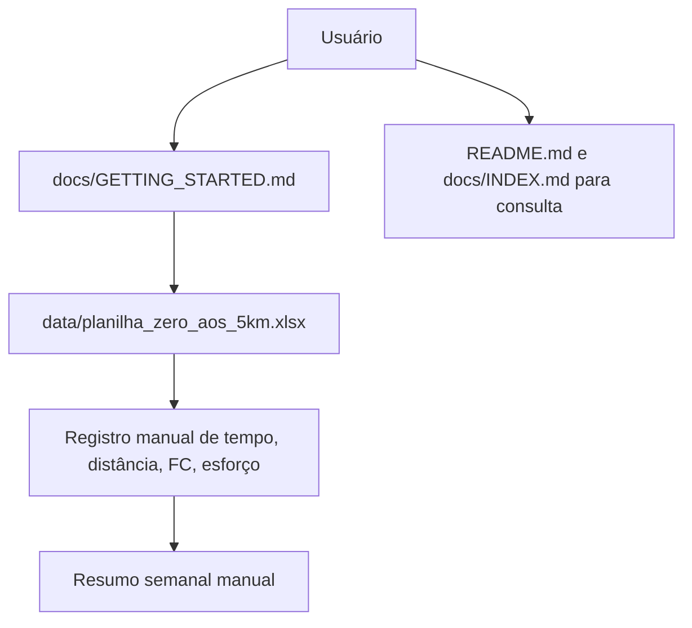

# Arquitetura do Projeto 0to5k

## 1. Resumo

O `0to5k` é um projeto **local-first** orientado a conteúdo, composto por:

- uma planilha `.xlsx` como núcleo de operação do programa;
- documentação em Markdown para instruções, contexto técnico e navegação.

Não há backend, API, banco remoto, autenticação ou integrações automáticas implementadas no estado atual.

## 2. Estrutura Atual do Repositório

```text
0to5k/
├── ARCHITECTURE.md
├── CLAUDE.md
├── README.md
├── .gitignore
├── assets/
│   └── images/
│       └── banner.png
├── data/
│   └── planilha_zero_aos_5km.xlsx
└── docs/
    ├── EXECUTIVE_SUMMARY.md
    ├── GETTING_STARTED.md
    ├── INDEX.md
    ├── PROJETO_FINAL.txt
    └── estrutura_planilha_zero_aos_5km.md
```

## 3. Componentes Centrais

### 3.1 Núcleo de Dados (Spreadsheet)

**Arquivo**: `data/planilha_zero_aos_5km.xlsx`

A planilha é o componente funcional principal, com três abas:

- `Plano de Treinos`: planejamento semanal e registro por sessão;
- `Dicas & Protocolo`: regras operacionais e orientações de segurança;
- `Resumo Semanal`: consolidação manual por semana.

Características atuais:

- sem fórmulas;
- sem validações de dados;
- consistência entre abas feita por preenchimento manual.

Referência de estrutura: `docs/estrutura_planilha_zero_aos_5km.md`.

### 3.2 Camada de Documentação

Arquivos de apoio:

- `README.md`: documentação principal para uso do programa;
- `docs/GETTING_STARTED.md`: guia rápido;
- `docs/INDEX.md`: índice de navegação;
- `docs/EXECUTIVE_SUMMARY.md`: visão executiva;
- `ARCHITECTURE.md`: visão arquitetural;
- `CLAUDE.md`: guia para assistentes de IA.

### 3.3 Ativos Estáticos

- `assets/images/banner.png`: ativo visual usado no `README.md`.

## 4. Fluxo Operacional (As-Is)



## 5. Decisões Arquiteturais Atuais

1. **Local-first**: dados ficam no dispositivo do usuário.
2. **Interoperabilidade por arquivo**: distribuição via `.xlsx`.
3. **Baixa complexidade operacional**: sem serviços externos obrigatórios.
4. **Documentação como interface**: Markdown centraliza orientação e manutenção.

## 6. Armazenamento e Privacidade

### 6.1 Armazenamento Primário

- `data/planilha_zero_aos_5km.xlsx` é o armazenamento persistente de uso.

### 6.2 Privacidade

- A privacidade depende do controle local do arquivo pelo usuário.
- O repositório não coleta telemetria nem transmite dados automaticamente.

## 7. Limitações Conhecidas

1. A consistência entre abas depende de preenchimento manual.
2. Não existe integração automática com plataformas de treino.
3. Parte da documentação ainda contém referências legadas e precisa de normalização para refletir apenas arquivos existentes no repositório atual.

## 8. Próximos Passos (Roadmap Reduzido)

### Curto prazo

- normalizar referências documentais para refletir apenas arquivos existentes;
- adicionar validação automática de links/documentação no CI.

### Médio prazo

- avaliar script de verificação de consistência da planilha (campos obrigatórios por semana);
- definir padrão de versionamento para mudanças de conteúdo da planilha.

### Longo prazo (hipótese)

- avaliar viabilidade de uma interface digital complementar à planilha.

## 9. Identificação do Projeto

- **Nome**: 0to5k
- **Repositório**: [github.com/prof-ramos/0to5k](https://github.com/prof-ramos/0to5k)
- **Responsável**: Gabriel Ramos
- **Última atualização deste documento**: 2026-02-21

## 10. Glossário

- **PSE**: Percepção Subjetiva de Esforço (escala de 1 a 10).
- **Local-first**: dados residem primariamente no cliente/arquivo local.
- **C25K**: Couch to 5K, protocolo-base adaptado para o contexto do projeto.
