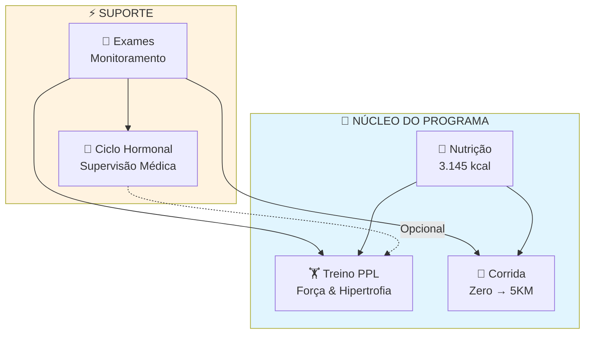
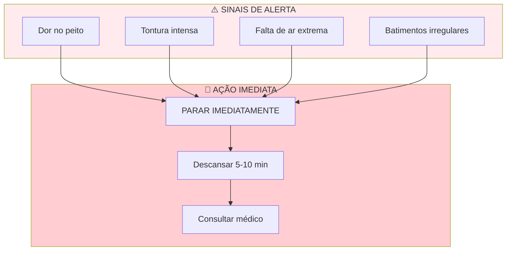
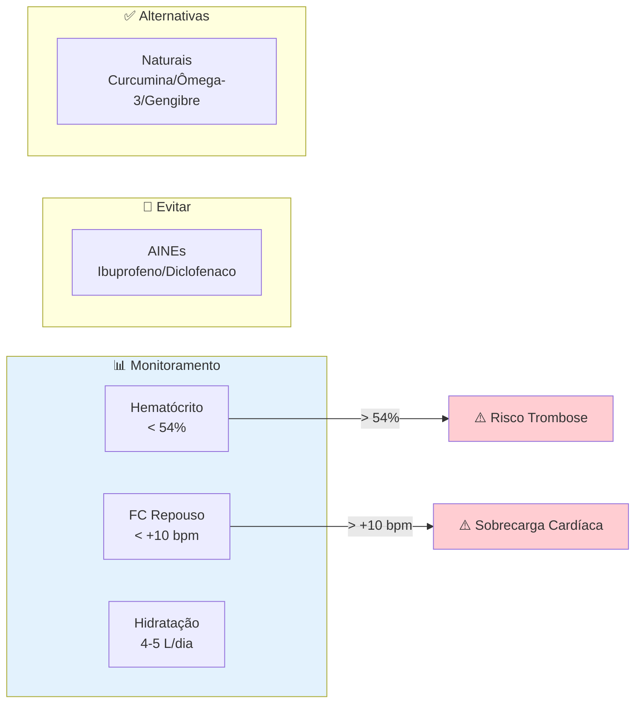
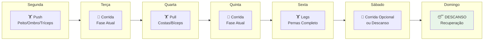
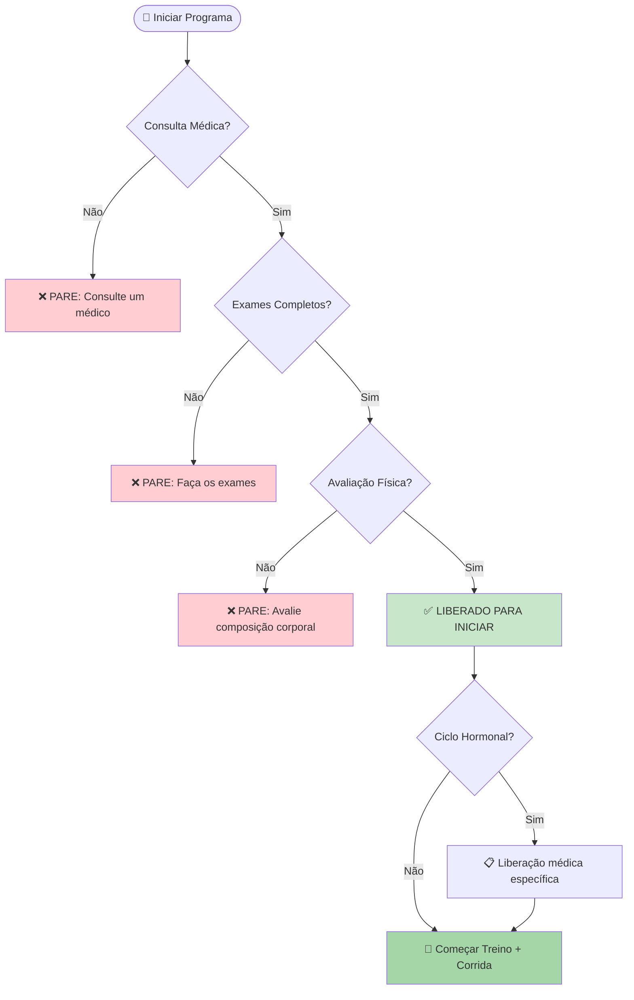
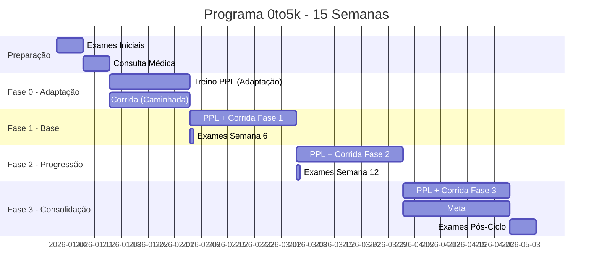

# 🏋 Programa Completo de Transformação — 0to5k

> **AVISO IMPORTANTE:** Este programa é fornecido APENAS PARA FINS EDUCACIONAIS. Consulte sempre um médico antes de iniciar qualquer protocolo de treinamento, nutrição ou terapia hormonal.

---

## 📋 Visão Geral

Este é um programa **completo e integrado** de 15 semanas desenhado para transformação total do corpo e saúde, combinando:

- 🏋 **Treino de Força** — PPL (Push/Pull/Legs) estruturado
- 🏃 **Corrida Progressiva** — "Zero aos 5KM" para sedentários/fumantes
- 🥗 **Nutrição Calculada** — 3,145 kcal com macro precisa
- 💉 **Protocolo Hormonal** — Sob supervisão médica estrita
- 🧪 **Monitoramento Laboratorial** — Protocolos de segurança completos

---

## 📚 Estrutura do Programa

Este repositório contém documentação separada para cada componente:

### 🏋 1. Treino de Força (`treino/`)

- **PPL Completo** — Guia de treinamento de força com periodização
  - [`treino_ppl_completo.md`](treino/treino_ppl_completo.md)
  - 15 semanas progressivas (Fases 0-3)
  - Biblioteca completa de exercícios
  - Estratégias de sobrecarga e periodização
  - Referências científicas e boas práticas

### 🏃 2. Programa de Corrida (`corrida/`)

- **Zero aos 5KM** — Corrida progressiva para sedentários
  - [`corrida_zero_5km.md`](corrida/corrida_zero_5km.md)
  - 15 semanas (4 fases)
  - Base científica com 7 estudos revisados
  - Protocolos seguros para fumantes
  - Orientações específicas para Brasília (clima seco)

### 🥗 3. Nutrição (`nutricao/`)

- **Plano Alimentar Calculado** — 3,145 kcal/dia
  - [`nutricao_calculada.md`](nutricao/nutricao_calculada.md)
  - **Macros:** 227g proteína (2.84g/kg), 344g carboidratos, 104g gordura
  - Planejamento de refeições
  - Timing pré/pós-treino
  - Lista de alimentos e substituições
  - Hidratação e suplementação básica

### 💉 4. Protocolo Hormonal (`ciclo/`)

- **Terapia sob Supervisão Médica**
  - [`ciclo_hormonal.md`](ciclo/ciclo_hormonal.md)
  - Testosterona Enantato: 250mg/sem
  - Nandrolona Decanoato: 100mg/sem
  - Protocolos de aplicação e rotação de sítios
  - Sinais de alerta e contraindicações
  - **ATENÇÃO:** Apenas sob supervisão médica estrita

### 🧪 5. Exames Laboratoriais (`exames/`)

- **Protocolos de Monitoramento e Segurança**
  - [`exames_monitoramento.md`](exames/exames_monitoramento.md)
  - Painel hormonal completo
  - Hematologia (hematócrito < 54%)
  - Função hepática e renal
  - Perfil metabólico (lipídios, glicose)
  - Saúde prostática (PSA)
  - Frequência de exames (inicial, 6 semanas, 12 semanas, pós-ciclo)
  - Valores de referência e faixas de segurança

---

## 📐 Arquitetura do Programa

---

## 📅 Fluxo Recomendado de Leitura

> **IMPORTANTE:** Os componentes são integrados. Exames laboratoriais são obrigatórios durante todo o programa, especialmente durante o ciclo hormonal.

---

## ⚠️ Avisos Críticos

### 🚨 Fluxo de Segurança

### Segurança Médica
- **Exames prévios obrigatórios:** Eletrocardiograma, exames de sangue completos
- **Contra-indicações absolutas:** Doenças cardiovasculares, insuficiência hepática/renal, câncer de próstata
- **Sinais de alerta:** Dor no peito, tontura, falta de ar extrema, batimentos irregulares
- **Parar imediatamente:** Se qualquer sinal de alerta ocorrer

### Durante o Ciclo Hormonal

- **Hematócrito crítico:** Deve permanecer abaixo de 54% (risco de trombose)
- **Hidratação:** Aumentar consumo de água (4-5L/dia) para reduzir risco trombótico
- **Frequência cardíaca:** Monitorar FC de repouso (aumento +10 bpm indica sobrecarga)
- **Evite:** AINEs (ibuprofeno, diclofenaco) — aumentam risco cardiovascular
- **AINEs naturais:** Use anti-inflamatórios naturais (curcumina, ômega-3, gengibre)

---

## 📊 Resumo de Metas

### 🔄 Integração Semanal

### 📋 Metas por Componente

| Componente     | Meta Principal              | Duração   | Frequência              |
|---------------|-----------------------------|-----------|------------------------|
| **Treino PPL** | Hipertrofia + Força funcional | 15 sem    | 3-6x/semana            |
| **Corrida 5KM** | 30 min contínuos            | 15 sem    | 3x/semana              |
| **Nutrição**   | +250-500kcal (hipertrofia)   | Contínuo  | Diária                 |
| **Ciclo Hormonal** | Manter níveis fisiológicos | 12-16 sem | 2x/semana              |
| **Exames**     | Monitorar segurança          | Contínuo  | Inicial, 6sem, 12sem, pós |

---

## 🔬 Base Científica

Este programa combina **+15 estudos revisados por pares** nas áreas de:

- **Fisiologia do Exercício:** Sobrecarga progressiva, hipertrofia, recuperação
- **Cardiologia do Exercício:** Corrida progressiva para sedentários/fumantes
- **Nutrição Esportiva:** Macros, timing, suplementação
- **Endocrinologia Clínica:** Terapia de reposição, monitoramento
- **Medicina Laboratorial:** Marcadores de segurança, faixas de referência

Todas as referências estão listadas nos respectivos documentos.

---

## 🚀 Como Começar

### Pré-requisitos Mínimos

**Checklist Obrigatório:**

- [ ] **Consulta médica completa** — AVALIAÇÃO CARDIOVASCULAR OBRIGATÓRIA
- [ ] **Exames de sangue iniciais** — Painel completo (veja `exames/exames_monitoramento.md`)
- [ ] **Avaliação física** — Peso, altura, composição corporal
- [ ] **Liberação médica** — Para iniciar ciclo hormonal (se aplicável)
- [ ] **Equipamento básico** — Tênis, roupa adequada, garrafa de água
- [ ] **Local de treino** — Academia ou espaço adequado

### 📅 Timeline do Programa

### Cronograma Sugerido

| Semana | Ação Principal | Checkpoints |
|--------|----------------|-------------|
| **0-1** | Exames + Consulta médica | Liberação para treinar |
| **2-4** | Fase 0 (Adaptação) | PPL leve + Caminhada |
| **5-8** | Fase 1 (Base) | Exames na semana 6 ⚠️ |
| **9-12** | Fase 2 (Progressão) | Exames na semana 12 ⚠️ |
| **13-15** | Fase 3 (Consolidação) | Meta: 5KM contínuo |
| **16+** | Pós-programa | Exames finais + Manutenção |

---

## 📞 Suporte e Responsabilidade

### O que Este Programa NÃO É

- ❌ Substituto para supervisão médica profissional
- ❌ Prescrição médica ou farmacológica
- ❌ Garantia de resultados
- ❌ Adequado para todos os indivíduos (requer avaliação individual)

### Responsabilidade do Usuário

Ao utilizar este programa, você concorda que:
- É responsável por consultar profissionais de saúde qualificados
- Entende que os resultados variam individualmente
- Interromperá o programa se apresentar sinais de alerta
- Não processará os autores por danos causados pelo uso indevido

---

## 📚 Documentação Detalhada

Cada componente tem sua própria documentação detalhada:

| Documento                                              | Linhas | Descrição                                 |
|--------------------------------------------------------|--------|--------------------------------------------|
| [`treino/treino_ppl_completo.md`](treino/treino_ppl_completo.md) | 390    | PPL completo com periodização             |
| [`corrida/corrida_zero_5km.md`](corrida/corrida_zero_5km.md)     | 198    | Zero aos 5KM baseado em evidências        |
| [`nutricao/nutricao_calculada.md`](nutricao/nutricao_calculada.md) | ~200  | Plano alimentar calculado                 |
| [`ciclo/ciclo_hormonal.md`](ciclo/ciclo_hormonal.md)            | ~250   | Protocolo hormonal supervisionado         |
| [`exames/exames_monitoramento.md`](exames/exames_monitoramento.md) | ~300  | Exames laboratoriais completos            |

---

## 📌 Metadados

- **Versão:** 2.0.0
- **Duração total:** 15 semanas
- **Público-alvo:** Sedentários, fumantes, iniciantes em fitness
- **Localização:** Brasília (clima seco) — ajustes aplicáveis para outras regiões
- **Base Científica:** +15 estudos revisados por pares
- **Licença:** Creative Commons Attribution-ShareAlike 4.0 International (CC-BY-SA 4.0)

---

_Criado por Gabriel Ramos em 2026._

**Todos os direitos reservados. Consulte sempre profissionais de saúde qualificados antes de iniciar qualquer protocolo de saúde ou fitness.**
